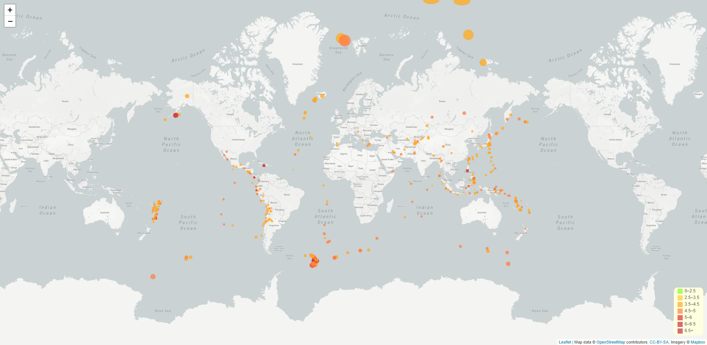
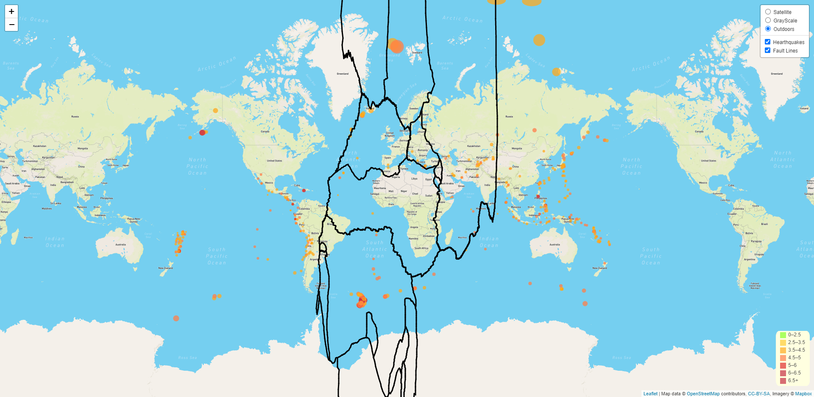

# **Visualizing Data with Leaflet**

In this assignment, the objective is to use GeoJSON to retrieve data from a website and show earthquakes using interactive maps.

  

  

## **1. Authors**

This project was created and authored by:
* **Latyr Thiao**

## **2. Requirements / Specifications**

The [business & technical requirements](01-Instructions) that must be met by the solution.

## **3. Prerequisites**

The mandatory steps to be taken to make the code work smoothly.

### **3.1 License & Key**

The following keys will be required:
* Mapbox key: [sign up here](https://www.mapbox.com/)
* Use your Mapbox key:
    * Map 1: [config file](02-Code/Leaflet-Step-1/01-static/js/config.js)
    * Map 2: [config file](02-Code/Leaflet-Step-2/01-static/js/config.js)
    

### **3.2 Installing**

The assumption here is that your computer is running on Windows 10.
Feel free to adjust if you are using a Mac OS or any other operating system.

What software do you need and how to install them?

* Any web browser (Chrome, ...) 
* Anaconda/Python terminal
* Any IDE that enable to write or read code (VS Code, ...)

## **4. Tools & Coding Languages**

The following tools and coding languages were used:
* HTML
* JavaScript (d3, Leaflet)
* Css

## **5. Data Source(s)**

The data used as input is coming from the following sources:
  * Map 1 & 2: [Dataset 1](https://earthquake.usgs.gov/earthquakes/feed/v1.0/summary/4.5_month.geojson)
  * Map 2 only: [Dataset 2](https://raw.githubusercontent.com/fraxen/tectonicplates/master/GeoJSON/PB2002_steps.json)

## **6. Run the code**

### **Step 1: The code is located here**
The code is available as follows:
  * Map 1: [HTML 1](02-Code/Leaflet-Step-1/index.html)
  * Map 2: [HTML 2](02-Code/Leaflet-Step-2/index.html)

### **Step 2: Extract all files & run the code**
* Download this entire project from Github
* Open VS Code or your IDE
* Choose 'File > Open Folder'
* Select the path to the folder located 1 level above the folder where the [HTML 1](02-Code/Leaflet-Step-1/index.html) is located. 
    * Example if your index file is located: Documents/.../Folder_Level_1_Above/16_Earthquakes_Web_Mapping_Leaflet
    * Select: Folder_Level_1_Above
* Right click the folder that contains your [HTML 1](02-Code/Leaflet-Step-2/index.html), it should be named: 15_Health_Risk_JavaScript_D3
* Select: Open in integrated terminal
* It should open the terminal
* In the terminal do the following:
    * Type the command 'conda activate Your_Environment_Name' ; Your_Environment_Name is the name of your Python environment you defined
    * Run the server by typing the following: 'Python -m http.server'
    * Then, copy/paste this url (http://localhost:8000/) into your browser and press enter
* The page should load the charts and you can now selection menu or dropdown list to show the desired information
* Don't forget to shut down the server by closing your Python terminal in VS Code

## **7. User Acceptance Testing**

See related document to learn more about acceptence criteria:  
* [See instructions](01-Instructions)

## **8. Deployment**

* You could also deploy this entire folder with your preferred service provider (Github, ...) where a website can be hosted
* See [how to host a website on Github](https://www.youtube.com/watch?v=M5mg0r4ajt4&list=TLPQMTgwODIwMjFMJ3NIh8pJ7w&index=2)

## **9. Expected result**

The outcome should be similar to the below:

  

 

  

 

